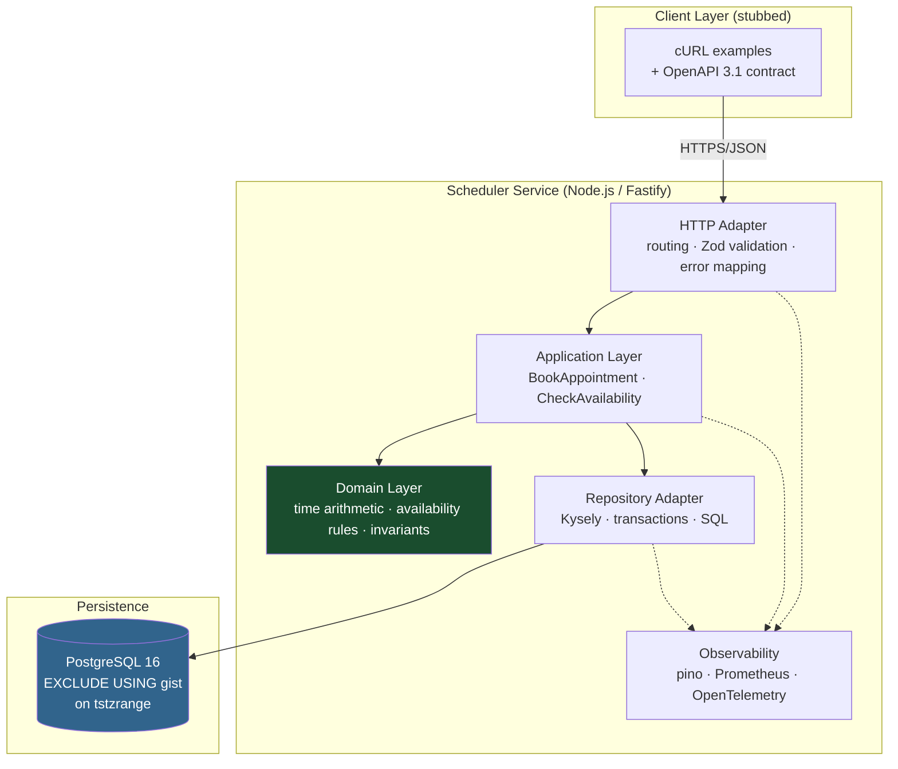
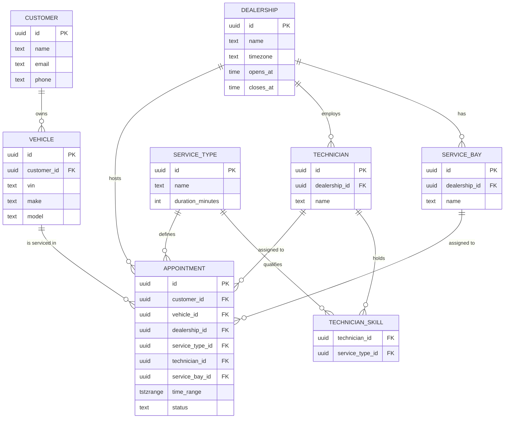
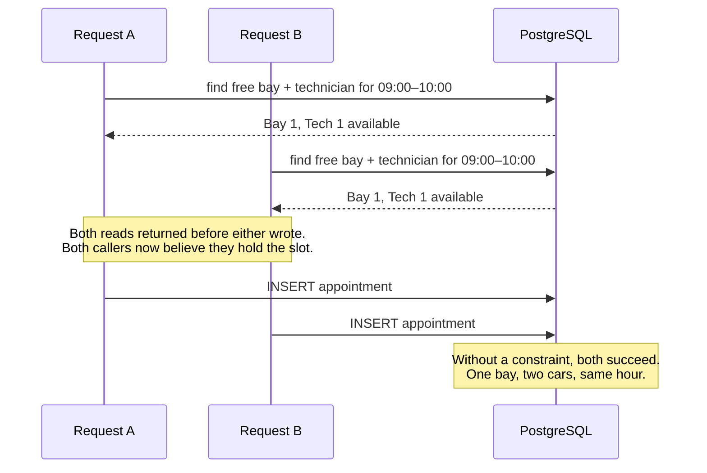
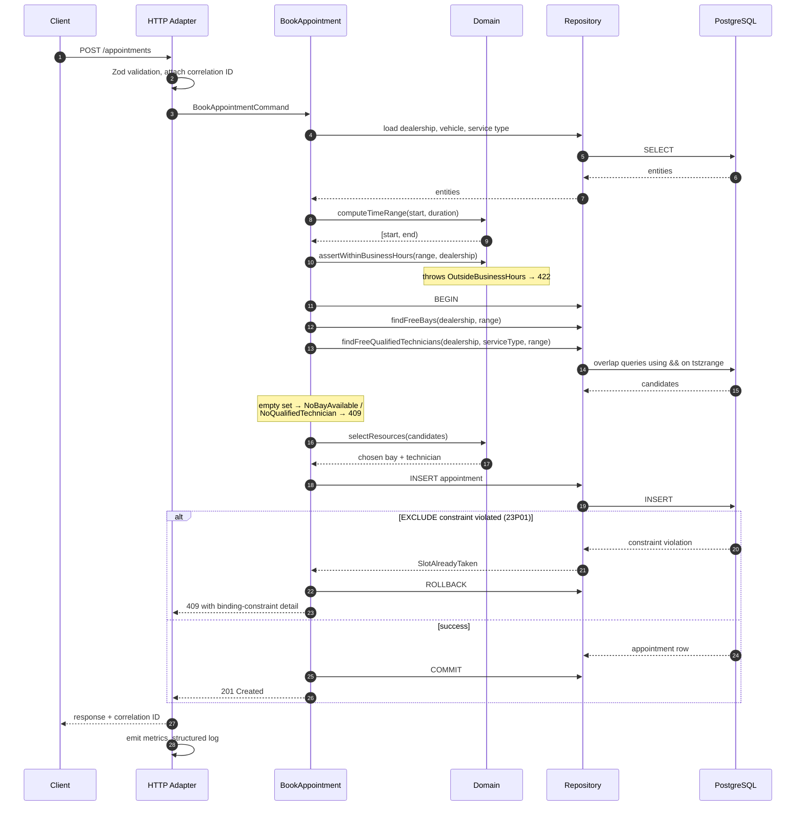

# System Design Document
## Unified Service Scheduler — Keyloop Technical Assessment, Scenario A

**Author:** Bui Vu Nam
**Layer implemented:** Backend (RESTful API + PostgreSQL). Client layer stubbed via
OpenAPI contract and cURL examples.
**Companion documents:** [`assumptions.md`](./assumptions.md) — ambiguity register.
[`../CLAUDE.md`](../CLAUDE.md) — the constraint document governing AI-assisted development
in this repository.

---

## 1. Problem Statement

A dealership service department has two scarce resources: **service bays** and
**technicians**. A booking is only real if both are free for the *entire* duration of the
job, and if the technician is qualified for the service type requested.

Stated that way it sounds like a lookup. It is not. The difficulty is that availability is
a claim about the future that two callers can make simultaneously, and the window between
"I checked and it was free" and "I wrote the booking" is where every naive implementation
of this problem breaks. A scheduler that is correct under sequential load and
double-books under parallel load has not solved the problem — it has moved the failure
somewhere harder to see.

**This document treats concurrent resource contention as the central design problem**, and
most of the decisions below follow from it.

---

## 2. Scope

**In scope:** booking a service appointment with real resource-constraint enforcement;
querying availability; persistent appointment records; an API contract; observability
foundations; a test suite that proves the constraint logic under parallel load.

**Out of scope, deliberately:** authentication, cancellation and rescheduling, pricing,
notifications, parts inventory, technician shift calendars, a user interface. Each is
recorded with its reasoning in `assumptions.md`. Nothing here is out of scope because it
was overlooked.

---

## 3. Architecture

### 3.1 Component view



The layering is Clean Architecture with dependencies pointing inward. The two shaded
components are where correctness actually lives: the domain layer holds the rules, and
the database holds the guarantee. Everything else is transport and translation.

### 3.2 Component responsibilities

| Component | Responsibility | Explicitly not responsible for |
| --- | --- | --- |
| **HTTP Adapter** | Route binding, schema validation at the boundary, mapping domain errors to status codes, correlation-ID propagation | Business rules. No handler contains an `if` about scheduling policy. |
| **Application Layer** | Orchestrating a use case: resolve entities, call the domain, open the transaction, persist, emit metrics | SQL, HTTP, or knowledge of which database is in use |
| **Domain Layer** | Time-range arithmetic, overlap predicates, qualification rules, invariant definitions, domain errors | Any I/O whatsoever. Fully unit-testable with no infrastructure. |
| **Repository Adapter** | Candidate queries, transaction management, translating Postgres constraint violations into domain errors | Deciding *which* candidate to pick — that is a domain policy |
| **Observability** | Structured logs, metrics, trace spans | Being in the hot path of a decision |
| **PostgreSQL** | Durable storage and, critically, **enforcement of the non-overlap invariant** | Nothing else. No business logic in triggers or stored procedures. |

The reason the database appears in a responsibility table at all is the point of
section 5: it is not a passive store here, it is an active participant in correctness.

---

## 4. Data Model



Two modelling decisions carry weight:

**`duration_minutes` lives on `service_type`, not on the appointment request.** The client
asks for a start time and a service; the server derives the end. This removes a class of
abuse where a caller understates duration to fit a gap, and it means duration policy has
exactly one home if it later needs to become dynamic (`assumptions.md` A-003).

**`time_range` is a `tstzrange` column, not a `start_time`/`end_time` pair.** This is what
makes the exclusion constraint in section 5 possible. It also makes overlap queries
expressible as `&&` rather than hand-written boundary comparisons, which removes the most
common source of off-by-one errors in scheduling code. Half-open `[start, end)` semantics
mean an appointment ending at 10:00 and one starting at 10:00 do not conflict — deliberate,
and covered by explicit tests.

---

## 5. The Core Problem: Concurrent Resource Contention

This section exists because it is the difference between a system that appears to work and
one that does.

### 5.1 The race



Read-then-write without protection is wrong under any isolation level below
`SERIALIZABLE`, because the rows that would conflict *do not exist yet* at read time.
There is nothing to lock.

### 5.2 Options considered

| Approach | How it works | Why not / why yes |
| --- | --- | --- |
| **Application-level check only** | Query availability, then insert | Rejected. The race above is unguarded. Passes every sequential test, fails in production. |
| **`SELECT … FOR UPDATE` on resources** | Lock the bay and technician rows before inserting | Workable, and a common answer. But it locks the *resource*, not the *time slot* — so two bookings for the same bay at completely different times serialise against each other unnecessarily. Correct but needlessly coarse. |
| **`SERIALIZABLE` isolation** | Let Postgres detect the anomaly and abort one transaction | Correct. But it pushes retry handling into every caller, and serialisation failures under load produce a confusing error surface. Reaching for the strongest isolation level is often a sign the constraint should have been modelled explicitly. |
| **Advisory locks keyed on (resource, time bucket)** | Hash the slot, take a lock | Correct, but the invariant now lives in application code and in a hashing scheme. Nothing stops a future migration script or a manual `INSERT` from violating it. |
| **✅ `EXCLUDE USING gist` constraint** | The database refuses to store two overlapping ranges for the same bay or technician | **Chosen.** The invariant is declared in the schema, enforced for every writer including manual SQL, and produces a deterministic, catchable error (SQLSTATE `23P01`). |

### 5.3 Chosen design

```sql
CREATE EXTENSION IF NOT EXISTS btree_gist;

ALTER TABLE appointment
  ADD CONSTRAINT no_bay_overlap
  EXCLUDE USING gist (service_bay_id WITH =, time_range WITH &&)
  WHERE (status = 'confirmed');

ALTER TABLE appointment
  ADD CONSTRAINT no_technician_overlap
  EXCLUDE USING gist (technician_id WITH =, time_range WITH &&)
  WHERE (status = 'confirmed');
```

The `WHERE (status = 'confirmed')` predicate is present from the first migration even
though cancellation is out of scope. It costs nothing now and means a cancelled
appointment will stop blocking its slot the day cancellation ships, rather than requiring
a constraint rebuild on a populated table.

The application-level availability query is still performed first. It is not the safety
net — it exists to produce a *useful* rejection ("no qualified technician is free")
instead of a bare constraint violation. The division of labour is explicit:

- **Application layer:** answers *why* a booking cannot happen, in business language.
- **Database:** guarantees that it *does not* happen, under any concurrency.

### 5.4 What this buys, and what it costs

**Buys:** correctness that cannot be bypassed; no lock ordering to reason about; a test that
is deterministic rather than timing-dependent; concurrency safety that survives a future
second service writing to the same table.

**Costs:** couples the design to PostgreSQL, since `EXCLUDE` constraints are not portable.
This is an accepted trade — the system's central guarantee is worth a database dependency,
and the repository interface means the coupling is confined to one adapter. If portability
ever became a real requirement, the fallback is `SERIALIZABLE` with retry, and that
decision would be isolated to the repository layer.

### 5.5 What building it revealed (and corrected)

The design above is sound on correctness, and the implementation never once double-booked.
But two things only became visible when the concurrency test ran against a real database
under parallel load — neither would have surfaced in a mock-based suite, and both are
recorded honestly here because the gap between a design and its measured behaviour is the
interesting part.

**Deterministic selection caused a thundering herd.** The first selection policy broke ties
on lowest id, for testability. Under load every concurrent request then chose the *same*
lowest-id pair and collided on the exclusion constraint, so a slot with capacity for four
filled only one of it. The fix was a random tiebreak plus a small bounded re-selection loop:
a booking that loses the race re-runs on a fresh transaction — whose new snapshot sees the
committed winner — and picks around it. This is not the "silent retry" the design rules out,
because the caller never named a technician; it is choosing a different one of ours, for the
same time. Measured effect: capacity utilisation under 12-way contention went from 1/4 to
4/4. (Assumptions A-014, A-015, A-021.)

**The exclusion constraint can deadlock, not only reject.** Concurrent inserts of
overlapping ranges take gist-index locks in an order Postgres sometimes resolves by aborting
one transaction with SQLSTATE 40P01, rather than the clean 23P01 the design anticipated. Left
unhandled this escaped as an HTTP 500. A deadlock victim has not necessarily lost the slot, so
it is retried on a fresh transaction by the same loop, and reaches the client as a 409 only if
every retry also deadlocks. Over 320 concurrent requests after the fix, no deadlock escaped
and nothing was double-booked. (Assumption A-022.)

The correction to 5.4 is therefore honest: there *is* now a bounded retry loop, contrary to
the original "no retry loops" claim. It sits in the application layer, it is bounded, and it
never turns a rejection into a duplicate — but it exists, because real contention on a real
database required it.

---

## 6. Data Flow: Booking Request



The two rejection paths are both 409 but are semantically different: steps before the
insert mean *nothing was available when we looked*; the constraint violation means
*something was available and someone else took it in the last few milliseconds*. Both are
surfaced distinctly in the response body and counted separately in metrics, because the
ratio between them is a genuine operational signal about contention.

---

## 7. Technology Choices

Each choice below is stated with what it was weighed against. A choice without a rejected
alternative is not a decision, it is a habit.

### PostgreSQL 16 — *over* MySQL, MongoDB
Chosen for range types and exclusion constraints, which are what make section 5 possible.
MySQL has no equivalent, and would have forced the invariant back into application code.
MongoDB was never a serious candidate: this is relational data with a hard cross-row
invariant, which is precisely the case document stores handle worst.

### Node.js 22 + TypeScript — *over* Go, Java/Spring
Go would give better raw concurrency ergonomics, but the concurrency here is resolved in
the database, not in the process, so that advantage does not apply. TypeScript gives
compile-time modelling of the domain, matches the ecosystem Keyloop already builds
front-of-house systems in, and is the stack I can move fastest and most confidently in
within the assessment's time budget. Choosing an unfamiliar language to look impressive
would have traded real correctness for the appearance of breadth.

### Fastify — *over* Express, NestJS
Fastify carries JSON Schema validation and pino logging as first-class concerns, which
means the observability and contract deliverables come partly for free. Express would need
both bolted on. NestJS supplies structure I have already imposed deliberately through
Clean Architecture, so it would add framework weight without adding decisions.

### Kysely — *over* Prisma, TypeORM, raw `pg`
This is the choice most specific to this problem. Prisma is excellent for CRUD but abstracts
away exactly the SQL I need control over — range operators, exclusion-constraint error
codes, explicit transaction boundaries. Raw `pg` gives full control but no type safety
across a schema that has ten related tables. Kysely sits precisely where this project
needs it: generated types from the schema, and unobstructed access to the SQL when the
query is doing something the query builder never anticipated.

### Vitest + Testcontainers — *over* Jest, mocked repositories
The most important test in this repository is a concurrency test against real PostgreSQL.
A mocked repository cannot exercise an exclusion constraint, so a mock-based suite would
give full green coverage of the one thing most likely to be wrong. Testcontainers spins up
a real database per suite; the cost is slower tests, which is the right trade for the one
guarantee the system exists to make.

### Zod — *over* framework-native validation only
Validation at the HTTP boundary produces parsed, typed values that the application layer
can trust, which is what allows the domain layer to contain zero defensive checks.

---

## 8. Observability Strategy

The organising question is not "what can we log" but **"what would we need to know at
03:00 when service advisors report that bookings are failing?"** Three signals answer that:
is the failure ours or theirs, is it one dealership or all, and is it contention or a bug.

### Logging
Structured JSON via pino. Every request carries a correlation ID (`x-correlation-id`,
generated when absent) attached to a child logger and echoed in the response, so a support
ticket quoting one ID retrieves the complete story of that booking attempt.

Logged at boundaries only — request received, request completed, database error, domain
rejection — never inside loops. Domain rejections log at `info` with the rejection reason
as a structured field, not embedded in a message string, so they aggregate.

PII discipline: customer names, emails, and phone numbers are never logged. VINs are
truncated to the last six characters, sufficient for support correlation without putting
vehicle identifiers in log storage.

### Metrics
Prometheus at `/metrics`:

| Metric | Type | Why it matters |
| --- | --- | --- |
| `bookings_total{outcome, dealership_id}` | counter | Rejection *rate* is the headline health signal. A rising rejection ratio means capacity pressure, not a bug. |
| `booking_rejections_total{reason}` | counter | Separates `no_bay` / `no_technician` / `outside_hours` / `slot_taken`. A spike in `slot_taken` specifically means contention is rising — a different response from a spike in `no_technician`. |
| `booking_duration_seconds` | histogram | p99 latency including the transaction |
| `availability_query_duration_seconds` | histogram | Isolates the expensive part; first thing to degrade as the appointment table grows |
| `db_pool_utilisation` | gauge | Transactions hold connections; saturation here presents as timeouts elsewhere |

Cardinality is controlled deliberately: `dealership_id` is a bounded set, but
`technician_id` and `customer_id` are not, and are never used as label values.

### Tracing
OpenTelemetry SDK is wired with a console exporter, and spans are created for the HTTP
handler, the availability query, and the insert transaction. A production deployment would
point the exporter at a collector; that integration is described rather than implemented,
because building it would consume assessment time without demonstrating a design decision.
The span boundaries are the part that matters, and they are real.

### Health
`/health` for liveness (process is up) and `/health/ready` for readiness (database
reachable), kept separate so an orchestrator restarts a wedged process but does not
restart a healthy process during a brief database blip.

---

## 9. Building for the Future

### Scalability
The service is stateless; horizontal scaling is adding instances. This is a direct
consequence of section 5 — because contention is resolved in the database rather than in
process memory, a second instance introduces no new correctness problem. Any design that
cached availability in-process would have made scaling out a redesign.

The database is the scaling limit. The path, in order: composite GiST indexes on
`(service_bay_id, time_range)` and `(technician_id, time_range)`, which the exclusion
constraints create automatically; read replicas for availability queries, which tolerate
mild staleness because the insert is authoritative; and only then partitioning
`appointment` by month, since queries are overwhelmingly for near-term ranges and old
partitions go cold naturally.

### Performance
The candidate queries are the hot path. Both are index-backed range lookups scoped to one
dealership, so cost is proportional to appointments at that dealership in that window —
not to total table size. The transaction holds no locks beyond the insert, so contention
between unrelated bookings is nil.

### Reliability
The invariant survives application bugs, because it is not enforced by the application.
That is the single most important reliability property here. Beyond it: fail-fast config
validation at startup, connection pool limits sized below the database's maximum so the
service degrades before the database does, and no retry logic that could turn a rejection
into a duplicate booking.

### Maintainability
The domain layer has no imports from outside itself and can be read as a statement of the
business rules. Adding a resource type — a specialist tool, a loan car — means one new
exclusion constraint and one new candidate query, following a pattern already established
twice. `assumptions.md` records not just what was assumed but the cost of reversing each,
which is the information a future maintainer actually needs.

### Known limitations
Documented honestly rather than discovered later: no idempotency key on booking
(`assumptions.md` A-016); business hours are a single window per dealership with no
holiday calendar (A-007, the weakest assumption in the register); single technician per
appointment is structurally expensive to reverse (A-010); no rate limiting.

---

## 10. Testing Strategy

Tests are shaped around the risk profile, not around coverage percentage.

| Layer | Approach | Rationale |
| --- | --- | --- |
| Domain | Pure unit tests, exhaustive boundary cases on time-range arithmetic | Cheapest place to be thorough; touching ranges, containment, identical ranges, zero-length rejection |
| Application | Unit tests with fake repositories | Verifies orchestration and error selection without database cost |
| Repository / HTTP | Integration tests against real PostgreSQL via Testcontainers | Overlap queries and constraint violations cannot be verified against a mock |
| **Concurrency** | N parallel `POST /appointments` for a slot where exactly one bay/technician pair exists | Asserts exactly one 201, N−1 409s, and exactly one row in the table. Deterministic via `Promise.all` — no sleeps, no timing assumptions. |

The concurrency test is the one that would have caught the naive implementation, and it is
the test I would point to first in a review.

---

## 11. GenAI in the Design Phase

> This section covers the **design** phase. The implementation-phase narrative — how AI
> output was directed, verified, and corrected while writing code — is in the README's
> AI Collaboration Narrative.

### Approach: AI as a challenger, not a generator

The failure mode I wanted to avoid is the one where an AI produces a plausible
architecture and the engineer's role degrades to approving it. My working rule for the
design phase was that AI could argue with a decision but could not make one, and that any
architectural claim had to survive my asking *why* until it bottomed out in something
concrete.

### Where it was used

**Scenario evaluation.** I had AI lay out the four scenarios against a consistent set of
criteria — depth of business logic, what each would let me demonstrate, and time risk. The
output was genuinely useful for scoping, and it is also where I first pushed back: the
initial analysis recommended a scenario primarily on the basis of implementation ease,
which is the wrong optimisation target for an assessment that explicitly evaluates system
design. Scenario A was chosen because concurrent resource contention is a real problem
with a non-obvious correct answer, not because it was the most convenient.

**Challenging the layer choice.** The initial recommendation to build the backend was made
before the role context was clear. When I supplied the actual role — Engineering Team Lead
— the recommendation was re-examined rather than defended, and the reasoning changed:
backend remained the right choice, but for a different and better reason. I mention this
because the useful behaviour was the revision, and it only happened because I supplied the
missing context rather than accepting the first answer.

**Assumption generation.** This was the highest-leverage use. I asked for an enumeration of
every ambiguity in the brief, then worked through them myself, discarding several and
adding the "if wrong, what does it cost to reverse" dimension that turned a list into a
decision record. The breadth came from AI; the judgement about which assumptions were
weak — A-007 and A-013 are marked low-confidence deliberately — is mine, and those are the
entries I would defend most carefully in a review.

**Trade-off enumeration.** For the concurrency problem I asked for the full option space
before choosing, specifically so that the exclusion-constraint approach would be a
selection rather than the first idea that worked. The five options in section 5.2 came out
of that. The evaluation of them — particularly the observation that `SELECT … FOR UPDATE`
locks the resource rather than the time slot, and that reaching for `SERIALIZABLE` usually
signals a constraint that should have been modelled explicitly — is the part I own.

### Where I deliberately did not use it

The half-open range semantics, the decision to put the invariant in the database rather
than the application, and the division of labour in section 5.3 — application explains
*why*, database guarantees *that* — were reasoned through on paper before any AI
involvement. These are the load-bearing decisions, and I wanted to be certain I could
defend them from first principles rather than recognise them as correct after the fact.

### The governance artifact

The most transferable output of the design phase is `CLAUDE.md` at the repository root. It
encodes the architecture, the non-negotiable technology choices, the invariants, the
testing requirements, and an explicit list of changes that require approval before an agent
makes them — locking strategy, schema, dependencies.

This is deliberately a *team* practice rather than a personal one. A constraint document
in version control means every engineer's AI produces code that converges on the same
architecture, and it makes AI-assisted work reviewable: a reviewer can ask whether the
output honours the document, instead of re-deriving intent from the diff. That is the
scaled version of the verification problem, and it is the pattern I would bring to a team.

---

## 12. Summary

The system is a small one, and deliberately so. Its value is concentrated in one decision:
that the non-overlap invariant belongs in the database as a declared constraint, not in
application code as a check. Everything else — the layering, the technology choices, the
observability signals, the shape of the test suite — either follows from that decision or
exists to make it visible and maintainable.

If I had one more day, it would go to the business-hours calendar (A-007) and an
idempotency key on booking (A-016), in that order.
